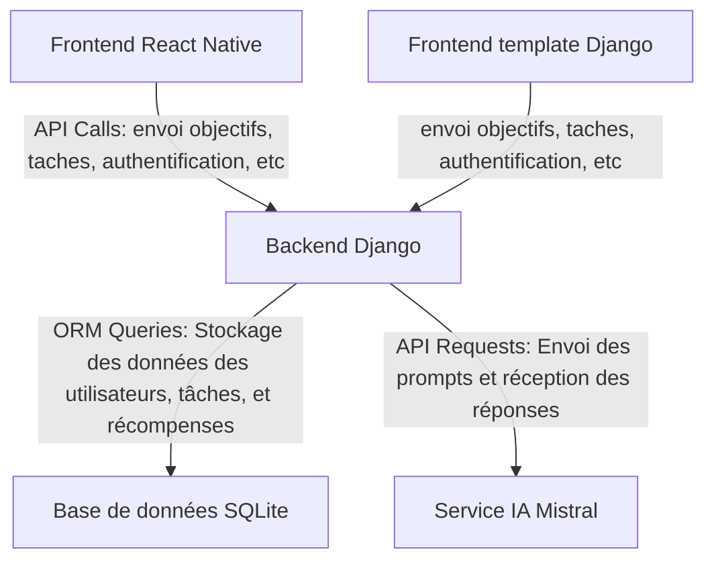
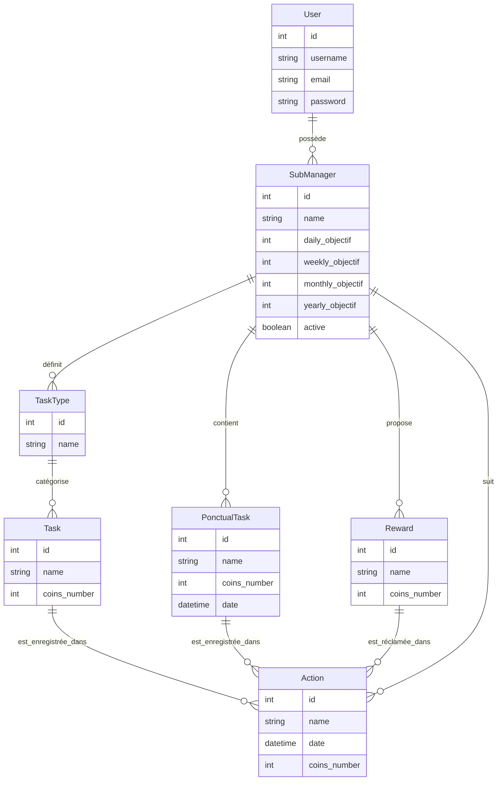
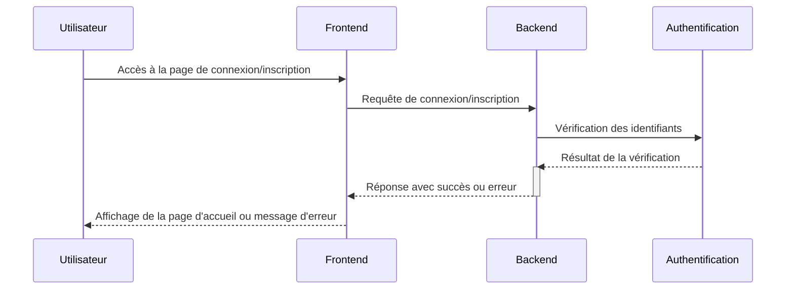
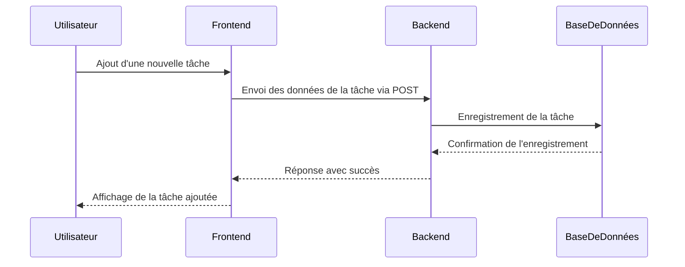
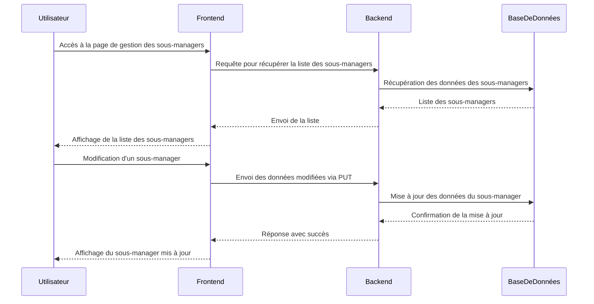
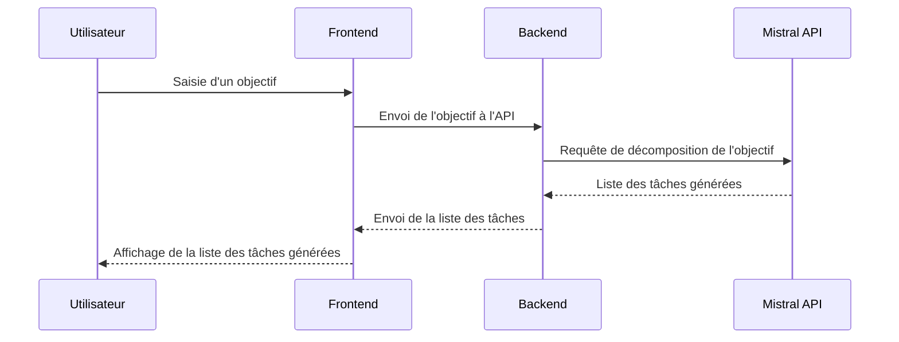

# Gestionnaire de Tâches

## Description

Le Gestionnaire de Tâches est une application Django conçue pour aider à gérer les tâches, les récompenses et les objectifs. Il permet de suivre les progrès quotidiens, hebdomadaires et mensuels, et de motiver l'exécution des tâches par l'obtention de récompenses.

L'application est visitable à cette adresse : <https://melody37.pythonanywhere.com/> avec un système d'authentification.
Vous pouvez donc créer un compte pour tester l'application.

Il existe aussi une application mobile Android liée via API à l'application Django.

## Fonctionnalités

- **Voir et gérer les tâches et récompenses:** Afficher les tâches et les récompenses disponibles, cliquer pour exécuter une tâche et suivre l'objectif quotidien.
- **Suivi des objectifs:** Suivi des objectifs quotidiens, hebdomadaires et mensuels.
- **Gestion des sous-managers:** Ajouter, modifier et supprimer des sous-managers.
- **Page d'historique des tâches:** Voir l'historique des tâches complétées.
- **Options de gestion:** Configurer les objectifs, gérer les tâches et les récompenses.
- **Décomposition d'objectifs en tâches:** Via implémentation de Mistral, possibilité de rentrer un objectif et se voir proposer des tâches à effectuer pour l'atteindre.
- **Authentification sécurisée:** Système d'authentification robuste pour protéger les données des utilisateurs.
- **Notifications:** (À implémenter) Notifications pour les tâches à venir et les objectifs atteints.
- **Rapports et statistiques:** (À implémenter) Génération de rapports et statistiques sur l'avancement des tâches et des objectifs.


## Instructions d'installation

**Prérequis:**

- Python 3.9+
- Node.js et npm (pour l'application mobile)
- Git


1. **Cloner le dépôt:**

   ```bash
   git clone <URL_du_dépôt>
   cd manager
   ```

2. **Installer les dépendances (backend):**

   ```bash
   pip install -r requirements.txt
   ```

3. **Installer les dépendances (frontend):** 
    ```bash
    cd TaskManagerApp
    npm install
    ```

4. **Configurer la base de données:** Utiliser la base de données SQLite par défaut.  Mettre à jour les paramètres de la base de données dans `manager/manager/settings.py` si nécessaire (pour utiliser PostgreSQL par exemple).

5. **Appliquer les migrations de la base de données:**

   ```bash
   python manage.py migrate
   ```

6. **Créer un superutilisateur (pour l'administration):**

   ```bash
   python manage.py createsuperuser
   ```

7. **Démarrer le serveur:**

   ```bash
   python manage.py runserver
   ```

8. **Accéder à l'application:** Ouvrez votre navigateur et allez sur `http://localhost:8000`.


## Architecture de l'application



**Technologies utilisées:**

- **Backend:** Django 4.2, Django REST Framework, PostgreSQL (recommandé), SQLite (développement), Python 3.9+
- **Frontend (Web):** Django Templates, HTML, CSS, JavaScript
- **Frontend (Mobile):** React Native
- **Base de données:** PostgreSQL (recommandé), SQLite (développement)
- **IA:** Mistral API


## Schéma de la base de données



## Parcours utilisateur

**1. Connexion/Inscription:**



**2. Ajout d'une tâche:**



**3. Gestion des sous-managers:**



**4. Décomposition d'objectif avec Mistral:**




## Contribution

Les contributions sont les bienvenues ! Veuillez soumettre un pull request ou ouvrir une issue pour toute suggestion ou amélioration. Veuillez respecter le style de codage existant et fournir des tests unitaires pour toutes les nouvelles fonctionnalités.

## A faire

### Corrections de bugs
- [ ] Immédiatement ramener à la page de login si le token n'est plus valide
- [ ] Mise à jour immédiate des tâches suite à suppression, ajout, modification, sans avoir besoin de passer par un autre submanager
- [ ] Résolution de l'erreur Uncaught (in promise) SyntaxError: "[object Object]" is not valid JSON en console
- [ ] résolution des erreurs rendant impossible la modification de mot de passe et l'oubli de mot de passe

### Fonctionnalités à Ajouter
- [ ] Page d'historique des tâches complétées
- [ ] Page des statistiques
- [ ] Pages de progression des objectifs mensuels, hebdomadaire, quotidiens
- [ ] Page des gestions des sous manager (ajout, modification des objectifs, suppression)
- [ ] un moyen de noter facilement des idées via speach to text
- [ ] Envoi de rappels pour les tâches à venir.
- [ ] Notifications basées sur les priorités et les délais.
- [ ] Amélioration de l'interface utilisateur
- [ ] Génération de rapports détaillés sur les performances des utilisateurs.
- [ ] Partage de tâches et d'objectifs avec d'autres utilisateurs.
- [ ] Suivi des progrès d'équipe.

### Optimisations Techniques
- [ ] Migration vers PostgreSQL
- [ ] Migration d'une IA externe à une IA locale
- [ ] Tests Unitaires et Intégration Continue
- [ ] Automatisation des déploiements via une chaîne CI/CD.
